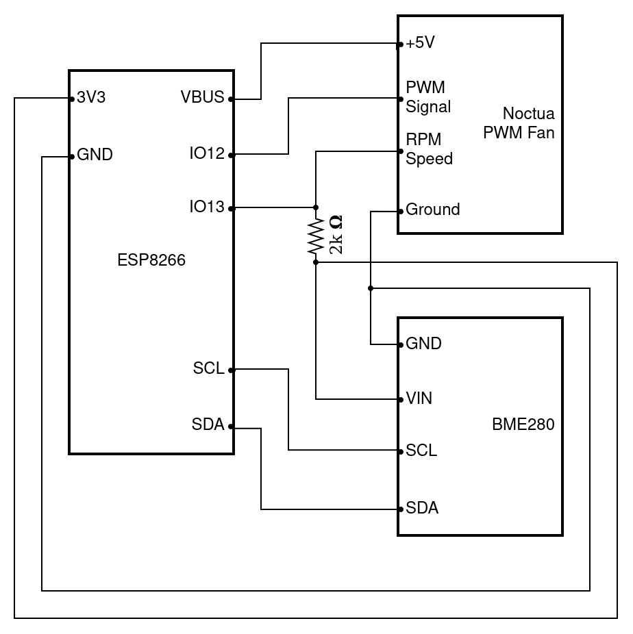
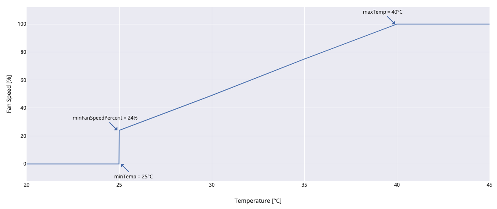

# esp8266-fan-control

ESP8266-based PWM fan control with a BME280 temperature sensor and an optional InfluxDB 2.0 integration.

## Hardware

The following hardware is used:
* [Adafruit Feather HUZZAH with ESP8266](https://www.adafruit.com/products/2821)
* [Noctua NF-A12x25 5V PWM](https://noctua.at/en/nf-a12x25-5v-pwm)
* BME280 sensor
* 2kΩ resistor (anything above 1kΩ should work, do your own research if you don't want to risk frying your ESP8266) 

## Setup

The ESP8266 needs to be powered via USB.



The BME280 sensor gets powered via the 3.3V and GND ports and data communication is connected via I2C using the SCL and SDA pins.

The PWM fan is powered (yellow wire) via the VBUS pin which provides 5V directly from the USB power. Connect GND of the fan (black wire) to the same GND as the sensor. For the PWM signal (blue wire) use GPIO12 (pin 6). The RPM speed signal (green wire) needs a 5V GPIO signal but the ESP8266's GPIO pins run on 3.3V. This can be solved by using a pull-up resistor (I use a 2kΩ resistor, larger resistors should work as well). Connect the RPM speed signal to GPIO13 (pin 7) and to the 3.3V pin through the pull-up resistor. For more details on the Noctua PWM fan specifications, check out the [Noctua PWM specifications white paper](https://noctua.at/pub/media/wysiwyg/Noctua_PWM_specifications_white_paper.pdf)

## Software

This software uses Adafruit's ESP8266 Feather board with the Arduino IDE as described [here](https://learn.adafruit.com/adafruit-feather-huzzah-esp8266/using-arduino-ide).

There are two version of the software:

* `fan-control-only` controls the fan with the behavior described below.
* `fan-control-and-influxdb` controls the fan and also transmits temperature and fan data via Wi-Fi to an InfluxDB server.

## Behavior

Adapt the constants at the beginning of the Arduino sketch to change the values.



The fan does not spin below `minTemp`. As soon as the temperature rises above `minTemp`, the fan starts spinning at `minFanSpeedPercent`. This is implemented because a lot of fans have a minimum rotational speed (e.g. the Noctua fan has a minimum speed of 450 RPM and a maximum speed of 1900 RPM, thus the 24% minimum). The fan starts spinning faster linearly until the temperature hits `maxTemp` at which the fan spins at 100%.

## InfluxDB

When using the InfluxDB version, first configure the Wi-Fi and InfluxDB connection at the top of the script. It is meant to be used with an InfluxDB 2.0 instance that is configured via URL, authentication token, organization, and bucket name. You can check the connection information via the serial console (baud rate 9600). It will connect to Wi-Fi, print the IP, synchronize the time via NTP, and connect to the InfluxDB server. Finally, it will start printing temperature and fan information in an infinite loop:

```
Connecting to Wi-Fi.....
Wi-Fi connected. IP address: 192.168.1.11

Syncing time.
Synchronized time: Sun May 23 17:57:09 2021

Connected to InfluxDB: https://192.168.1.10:8086

Temperature is 29.12 deg C
Setting fan speed to 44 %
Fan speed is 384 RPM
```

The software will write a measurement called `fan_control` every 10 seconds in the InfluxDB bucket that you configured. That measurement has 3 fields:

* `temperature` (unit: °C): The measured temperature.
* `fan_speed_percent` (unit: %): The speed that the fan is supposed to spin at based on the configuration.
* `actual_fan_speed_rpm` (unit: RPM): The speed that the fan is actually spinning at as measured by the fan's RPM speed signal.

## Grafana Dashboard

t.b.d.
